# Antigravity 對話與導航增強套件 (`agy-enhancer`)

[繁體中文](README.zh-TW.md) | [English](README.md) | [简体中文](README.zh-CN.md)

---

### 📌 快速導航
[🚀 運行環境與安裝](#setup) · [✨ 核心功能](#features) · [🎨 參數自訂](#customization) · [📜 油猴腳本](#userscript) · [❓ 常見問題 FAQ](#faq) · [📦 立即下載](https://github.com/atjjme/agy-enhancer/releases/latest)

---

### ✨ 期望

隨著 Antigravity 版本的更新，本專案慢慢消失

---

### 🚀 運行環境與安裝

#### 1. 前置環境要求
- **作業系統**：Windows 10 / Windows 11
- **軟體環境**：
  - **Antigravity 2.0 桌面用戶端**（支援所有最新版本）；
  - **[Node.js](https://nodejs.org/)** 環境（推薦 LTS 版本，Node.js 16+ 均可，用於執行本機輕量守護服務。可在終端機輸入 `node -v` 驗證是否已安裝）。

#### 2. 下載安裝包
👉 **[點擊前往 Releases 下載最新版本 ZIP 壓縮包](https://github.com/atjjme/agy-enhancer/releases/latest)** 並解壓縮至任意資料夾。

#### 3. 一鍵安裝與開機自啟（推薦）
按兩下執行解壓後根目錄下的：
👉 **`install.bat`**（或 **`setup-autostart.bat`**）
- **`install.bat`** 是普通使用者熟悉的安裝名稱；
- **`setup-autostart.bat`** 是核心機制的表現名稱；
- 兩者功能完全一致：自動配置 Windows 開機自啟並在後台靜默啟動守護服務（無黑框彈窗；注入成功後 Antigravity 介面右上角會有綠色狀態圓點指示）。

#### 4. 手動啟動與停止
- **`start-service-silent.vbs`**：後台靜默啟動守護服務（無黑框）。
- **`stop-service.bat`**：停止並結束後台守護服務。
- **`start-enhancer.bat`**：主控台除錯模式（顯示終端視窗，便於查看即時載入與互動日誌）。

#### 5. 解除安裝
按兩下執行：
👉 **`uninstall.bat`**
- 自動清理 Windows 開機自啟項目並立刻停止後台守護服務。

---

### ✨ 核心功能與操作

1. [指令碼生效：在 Antigravity 2.0 介面右上角顯示綠點指示](#feature-1)
2. [快速定位：介面右下角顯示「向上」「向下」按鈕](#feature-2)
3. [專案封存：未完成暫時不處理的專案可以一鍵封存](#feature-3)
4. [右鍵選單：操作介面全面加入右鍵功能](#feature-4)
5. [對話閱讀記憶：記住每個對話閱讀的進度](#feature-5)
6. [智慧未讀判定：真實閱讀完輸出資訊後再標記為已讀](#feature-6)

---

####  1. 指令碼生效：在 Antigravity 2.0 介面右上角顯示綠点指示

- **說明**：指令碼成功啟動並注入後，Antigravity 用戶端右上角會出現一個綠色圓點指示器，直觀標識增強功能已就緒生效。

> 📷 **功能示範影片 / 圖片**：
>
> 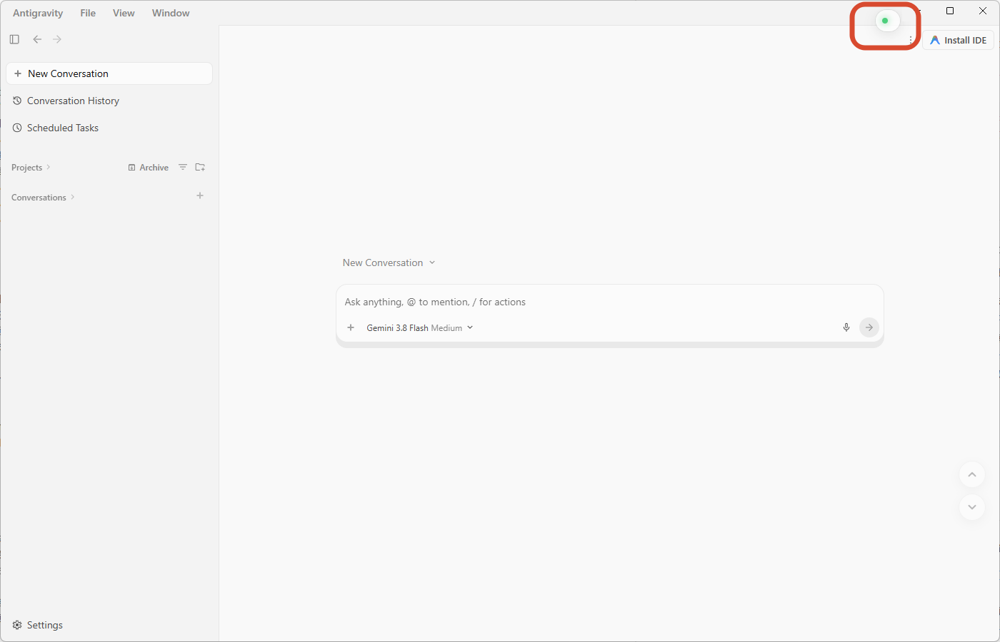

[↑ 返回核心功能導航](#features)

---

####  2. 快速定位：介面右下角顯示「向上」「向下」按鈕

- **原因**：原生用戶端在 AI 輸出完成長篇回答後，頁面會停留在最底部。使用者若想從頭閱讀，需要頻繁手動向上滑動翻閱，極易滑過目標內容，既耗費時間且難以精準定位。
- **效果**：
  1. **點擊【向上 (↑)】**：平滑捲動到當前提示詞（Prompt）的頂端；若已在頂端，可連續點擊切換到上一輪提示詞。在首個提問處點擊則直達對話頂部；
  2. **點擊【向下 (↓)】**：平滑捲動到當前回答（Response）的尾部；若已在尾部，連續點擊可跳至下一輪回答尾部；
  3. **按兩下【向下 (↓)】**：直接平滑捲至整個對話的最底部。

> 📷 **功能示範影片 / 圖片**：
>
> <table>
>   <tr>
>     <td align="center" width="50%"><strong>靜態預覽</strong> 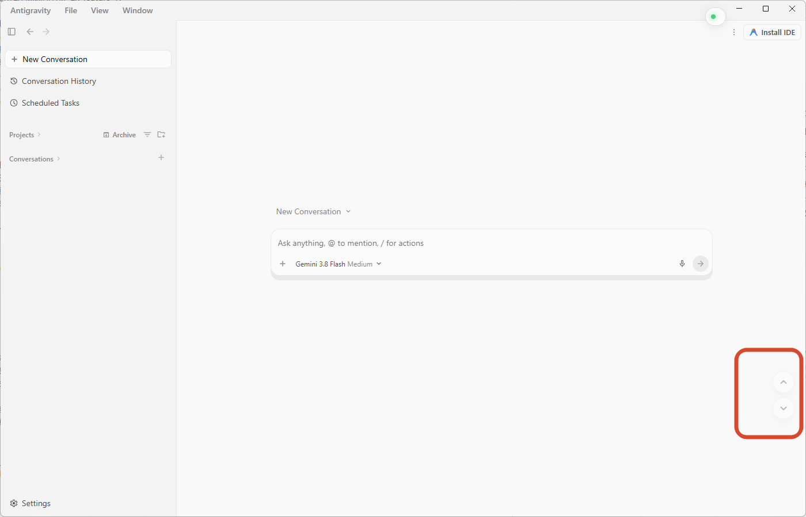</td>
>     <td align="center" width="50%"><strong>操作演示</strong> 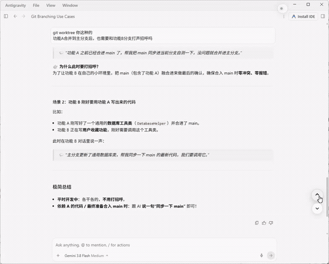 <a href="./assets/2026-09-07_11-27-16.mp4">▶ 查看高畫質原畫影片</a></td>
>   </tr>
> </table>

[↑ 返回核心功能導航](#features)

---

####  3. 專案封存：未完成暫時不處理的專案可以一鍵封存

- **原因**：部分暫時未完成但又不願刪除的專案，長期留在側欄會佔用大量垂直空間；封存後能保持介面整潔，原專案與對話資料依然完整保存。
- **效果**：
  1. **一鍵快速封存**：滑鼠懸停在左側任意專案上，點擊右側 **📥** 圖示即可將該專案封存折疊，立刻從主專案列表中隱藏，騰出垂直空間；
  2. **查看與還原**：在 `Projects` 標題列右側點擊 **`Archive`** 按鈕（有封存專案時附帶數字徽標），展開折疊面板，點擊 **`Restore`** 按鈕或使用右鍵選單，即可隨時恢復回主列表；
  3. **互動自動解除封存**：在已封存專案中發起新對話或在歷史對話中繼續提問時，系統會自動解除封存並恢復顯示在主列表中；
  4. **完美契合原生主題**：深度適配 Antigravity 原生 Tailwind 與 CSS 變數，深色/淺色模式無縫自適應。

> 📷 **功能示範影片 / 圖片**：
>
> <table>
>   <tr>
>     <td align="center" width="50%">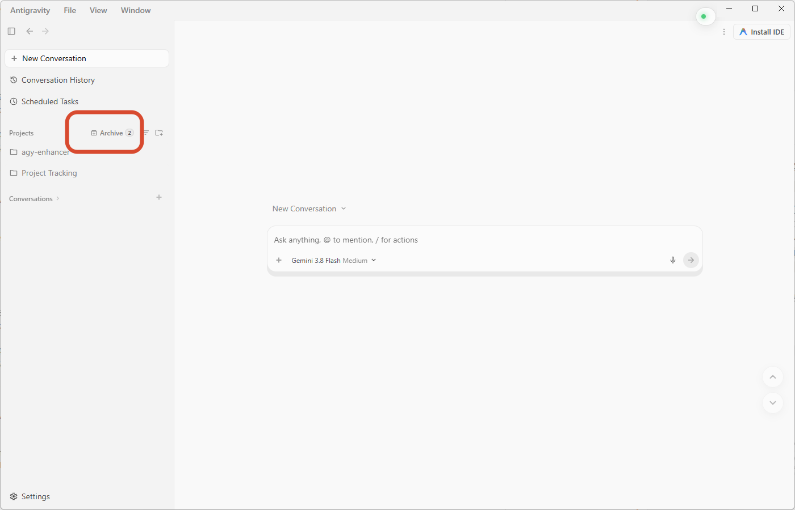</td>
>     <td align="center" width="50%">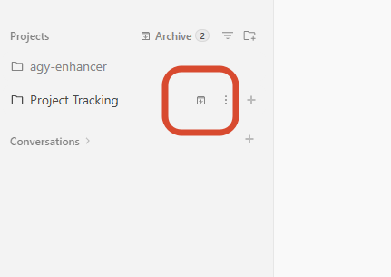</td>
>   </tr>
>   <tr>
>     <td align="center" width="50%">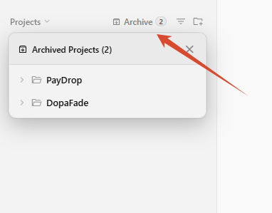</td>
>     <td align="center" width="50%">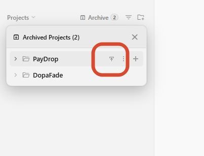</td>
>   </tr>
> </table>

[↑ 返回核心功能導航](#features)

---

####  4. 右鍵選單：操作介面全面加入右鍵功能

- **原因**：
  1. 原生用戶端暫未提供右鍵捷徑選單，很多高頻操作層級較深或無法直接觸發；
  2. 透過右鍵上下文選單可集中提供複製、路徑定位、檔案管理、引用提問等操作，顯著提升互動效率。
- **效果**：

#### 一、左側欄右鍵捷徑操作
- **未封存對話**：
  1. 將「Copy」二級子選單直接提升為一級選單，減少點擊層級；
  2. 新增「開啟對話所在目錄」（在本機檔案總管中醒目定位）。
- **專案對話**：
  1. 將「Copy」二級子選單提升為一級選單；
  2. 新增「開啟對話所在目錄」；
  3. 新增「開啟所在專案目錄」。
- **專案列表項**：
  1. 新增「開啟所在專案目錄」。

#### 二、聊天主區域（提問區 & 回覆區）右鍵選單規範

**嚴格順序**排列：

| 觸發場景 / 目標實體 | 英文選單項 (嚴格按此順序) | 功能行為說明 |
| :--- | :--- | :--- |
| **反白選取文字** *(提問或回覆中劃選文字)* | 1. **`Copy`** 2. **`Quote`** *(劃選網址額外提供: 3. `Open Link in Browser` 4. `Copy Link Address`)* *(劃選路徑額外提供: 3. `Reveal in Explorer` 4. `Copy Path`)【不劃選也可識別】* 5. **`Search`** | • 複製選取文字到剪貼簿 • 將文字以引用格式填入下方提問輸入框 • 智慧識別劃選內容：劃選網址可直接在瀏覽器開啟或複製網址；劃選本機路徑可直接開啟目錄或複製所在目錄【不劃選也可識別】 • 呼叫預設搜尋引擎（Google）在外部瀏覽器中搜尋所選內容 |
| **程式碼區塊** *(未劃選文字)* | 1. **`Copy Code`** 2. **`Save As...`** | • 複製當前程式碼區塊全部純文字（優先觸發原生複製按鈕） • 另存/匯出該程式碼區塊為本機檔案（智慧識別語言後綴） |
| **超連結** *(Hyperlink / URL)* | 1. **`Open Link in Browser`** 2. **`Copy Link Address`** | • 在系統預設外部瀏覽器中打開連結（僅開啟一次） • 複製完整超連結網址到剪貼簿 |
| **本機路徑** *(Local Path)* | 1. **`Reveal in Explorer`** 2. **`Copy Path`** *(僅所在目錄)* *(圖片路徑額外支援: 3. `Copy Image`)* | • 在本機 Windows 檔案總管中開啟定位該路徑 • 複製所在目錄的絕對路徑（不帶檔案名稱） • 若指向圖片檔案，支援直接複製圖片點陣圖 |
| **實體檔案 / 制品卡片** *(Artifact Card / 附件)* | 1. **`Reveal in Explorer`** 2. **`Copy Path`** *(僅所在目錄)* *(圖片檔案額外支援: 3. `Copy Image`)* | • 在本機檔案總管中開啟並定位檔案所在目錄 • 複製該檔案所在目錄的絕對路徑（不帶檔案名稱） • 若卡片指向圖片檔案，支援直接複製圖片點陣圖 |
| **圖片** *(Image)* | 1. **`Copy Image`** 2. **`Reveal in Explorer`** *(本機/落盤圖片)* 3. **`Copy Path`** *(僅所在目錄)* 4. **`Save Image As...`** | • 複製圖片二進位點陣圖到系統剪貼簿（免去中繼網址，可直接貼上使用） • 在檔案總管中開啟其所在資料夾 • 複製圖片所在目錄的絕對路徑（不帶檔案名稱） • 另存為本機圖片檔案（免去手動輸入檔名） |
| **訊息對話框空白處** *(回覆區 / 提問區空白處)* | *(暫不啟用 / 不彈出)* | • 已全部去除，保持介面純淨及放行潛在原生互動 |

---

#### 三、右側欄（製品 / 程式碼 / 預覽）右鍵選單規範

**嚴格順序**排列：

| 觸發場景 / 目標實體 | 英文選單項 (嚴格按此順序) | 功能行為說明 |
| :--- | :--- | :--- |
| **選取文字 / 程式碼行** *(Text / Code Selection)* | 1. **`Comment`** 2. **`Copy`** 3. **`Quote`** 4. **`Explain`** | • 屏蔽原生懸浮窗，點擊呼叫原生行間批註/評論框 • 複製選取文字或程式碼到剪貼簿 • 屏蔽原生懸浮窗，點擊將選取內容以引用格式填入提問框 • 提問框自動填入預設解釋 Prompt 並帶上該程式碼 |
| **程式碼區塊 / 編輯器空白處** *(未劃選文字)* | 1. **`Copy Code`** 2. **`Reveal in Explorer`** *(製品/本機程式碼檔案)* 3. **`Copy Path`** *(僅所在目錄)* 4. **`Save As...`** | • 複製當前程式碼全文（優先觸發原生複製按鈕） • 在本機 Windows 檔案總管中醒目定位當前程式碼檔案 • 複製當前程式碼檔案所在的目錄路徑（不帶檔案名稱） • 匯出/另存為本機檔案 |
| **圖片** *(Image)* | 1. **`Copy Image`** 2. **`Reveal in Explorer`** *(本機/落盤圖片)* 3. **`Copy Path`** *(僅所在目錄)* 4. **`Save Image As...`** | • 複製圖片點陣圖到系統剪貼簿（可直接貼上為圖像） • 在檔案總管中開啟圖片所在的目錄 • 複製圖片所在目錄的絕對路徑（不帶檔案名稱） • 另存為本機圖片檔案（免去手動命名） |
| **超連結** *(Hyperlink / URL)* | 1. **`Open Link in Browser`** 2. **`Copy Link Address`** | • 在系統預設外部瀏覽器中開啟該網址（僅開啟一次） • 複製該連結完整 URL 到剪貼簿 |
| **本機路徑** *(Local Path)* | 1. **`Reveal in Explorer`** 2. **`Copy Path`** *(僅所在目錄)* *(圖片路徑額外支援: 3. `Copy Image`)* | • 在本機檔案總管中直接開啟定位該路徑 • 複製所在目錄的絕對路徑（不帶檔案名稱） • 若為圖片檔案，支援直接複製圖片點陣圖 |
| **右側欄空白處** *(未劃選文字)* | 1. **`Reveal in Explorer`** 2. **`Copy Path`** *(僅所在目錄)* *(圖片製品額外支援: 3. `Copy Image`)* | • 在檔案總管中開啟當前活動製品/檔案所在的目錄 • 複製當前製品所在目錄的絕對路徑（不帶檔案名稱） • 若當前為圖片製品，支援直接複製圖片點陣圖 |

> 📷 **功能示範影片 / 圖片**：
>
> <table>
>   <tr>
>     <td align="center" width="50%">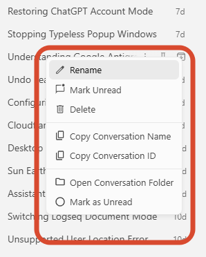</td>
>     <td align="center" width="50%">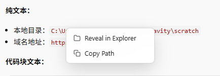</td>
>   </tr>
>   <tr>
>     <td align="center" width="50%">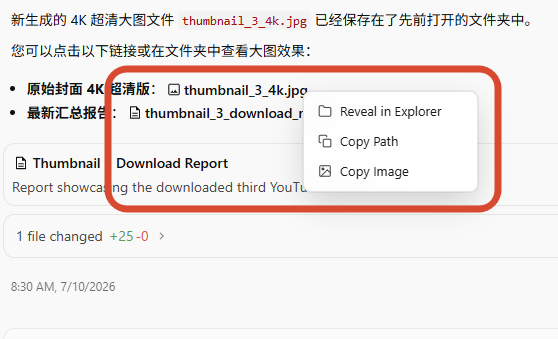</td>
>     <td align="center" width="50%">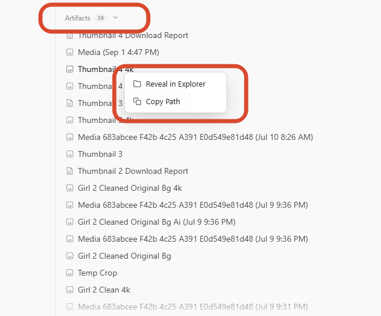</td>
>   </tr>
> </table>

[↑ 返回核心功能導航](#features)

---

####  5. 對話閱讀記憶：記住每個對話閱讀的進度

- **原因**：原生用戶端在每次切換對話時，都會將頁面強制重設捲動到底部。閱讀長篇對話或程式碼時極為不便，需要反覆重新滑找此前閱讀的位置。
- **效果**：
  1. **自動記憶閱讀位置**：切換對話時自動保存並恢復瀏覽進度，即使重啟用戶端或電腦依然生效；
  2. **智慧容量管理**：預設記錄最近 50 條對話的閱讀進度（若對話已自然處於最底部則不佔用記錄額度）。

> 📷 **功能示範影片 / 圖片**：
>
> 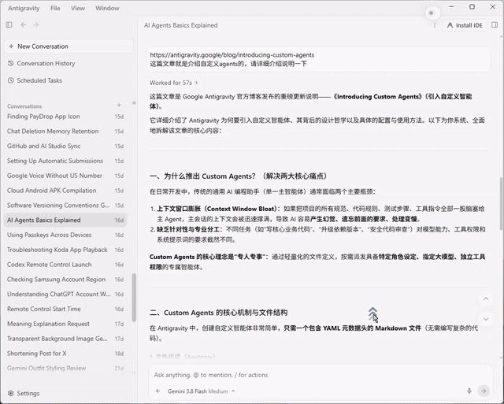 <a href="./assets/2026-09-07_11-41-40.mp4">▶ 查看高畫質原畫影片</a>

[↑ 返回核心功能導航](#features)

---

####  6. 智慧未讀判定：真實閱讀完輸出資訊後再標記為已讀

- **原因**：
  1. 在當前對話生成內容時，若使用者中途切換到其他對話，該對話會被原生用戶端錯誤地提前標記為「已讀」，導致使用者遺漏後續輸出；
  2. 對話在後台執行任務並生成完畢後，使用者只要點擊進入但即便未實際瀏覽內容，系統也會直接標記為「已讀」。
- **效果**：
  引入智慧未讀判定機制，確保使用者真實瀏覽後再更新狀態，避免誤判漏讀：
  1. **長文資訊**：需二次捲動到底部且停留滿 5 秒後，才標記為已讀；
  2. **短文資訊**：二次捲動到底部或停留滿 10 秒後，自動標記為已讀；
  3. **手動控制**：支援在左側欄右鍵選單中手動標記為「已讀」或「未讀」。

> 📷 **功能示範影片 / 圖片**：
>
> 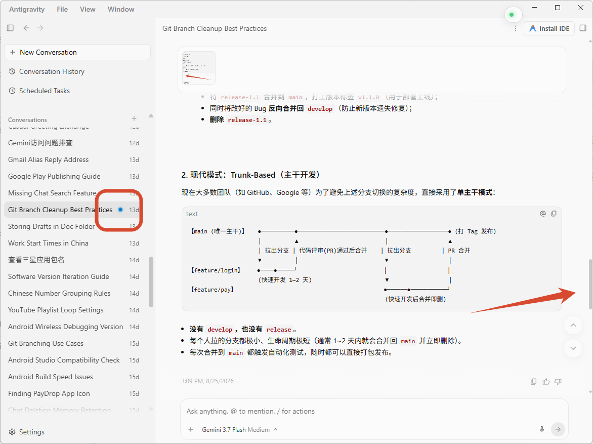

[↑ 返回頂部導航](#quick-nav)

---

### 🎨 參數自訂與熱更新

您可以使用任意文字編輯器開啟 [`src/agy-enhancer.js`](./src/agy-enhancer.js)，在頂部的 `USER_CONFIG` 物件中根據個人喜好調整介面參數：

- `BUTTON_OPACITY`: 平時靜止時的半透明度（預設 `0.3`，即 30% 透明度，避免遮擋程式碼與文字）；
- `BUTTON_HOVER_OPACITY`: 滑鼠懸停時的透明度（預設 `1.0` 完全清晰）；
- `NAV_RIGHT`: 導航按鈕距離視窗右側邊緣的間距（預設 `20px`）；
- `NAV_BOTTOM`: 導航按鈕距離底部輸入框的高度（預設 `170px`）；
- `BUTTON_SIZE`: 導航按鈕的圓形直徑（預設 `38px`）。

> ⚡ **毫秒級極速熱更新**：
> 修改配置並按下 `Ctrl + S` 儲存後，後台守護服務會在 **0.1 秒內自動同步生效**至用戶端視窗，無需重新啟動用戶端或重新載入軟體！

[↑ 返回頂部導航](#quick-nav)

---

### 📜 油猴腳本 (Userscript) 指南

除了作為 Windows 後台常駐守護服務使用外，本專案還提供了油猴使用者腳本檔案 [`agy-enhancer.user.js`](./agy-enhancer.user.js)。

如果您透過主流瀏覽器（Chrome、Edge、Firefox 等）存取 Antigravity 的 Web 端或本機網頁端介面：
1. 確保瀏覽器已安裝 [Tampermonkey](https://www.tampermonkey.net/) 擴充套件；
2. 將根目錄下的 [`agy-enhancer.user.js`](./agy-enhancer.user.js) 拖曳進瀏覽器視窗，或在 Tampermonkey 管理面板中選擇「新增新腳本」並將程式碼複製儲存；
3. 造訪 Antigravity Web 介面時，腳本將自動載入並提供完整的導航、封存與右鍵增強能力。

[↑ 返回頂部導航](#quick-nav)

---

### ❓ 常見問題排查 (FAQ)

#### Q1: 執行安裝後，Antigravity 右上角沒有出現綠色圓點？
1. **用戶端執行狀態**：請確保 Antigravity 2.0 桌面端已啟動；
2. **檢測 Node.js 環境**：開啟命令列（CMD 或 PowerShell），輸入 `node -v`。若提示找不到指令，請前往 [Node.js 官網](https://nodejs.org/) 下載並安裝 LTS 版本；
3. **查看排錯日誌**：按兩下執行根目錄下的 `start-enhancer.bat`（除錯主控台模式），查看終端機中輸出的連接埠偵測及連線日誌；
4. **視窗重新整理重試**：如果在打開用戶端後曾按過 `Ctrl + R` 強制重新整理，服務通常會在 0.2 秒內自動重新載入。

#### Q2: 專案後續發布新版本，如何更新？
直接前往 [Releases 最新發布頁面](https://github.com/atjjme/agy-enhancer/releases/latest) 下載新的 ZIP 壓縮包，解壓縮並覆蓋本機同名檔案即可。
- 如果後台守護服務正在執行，修改/覆蓋 `src/agy-enhancer.js` 時會觸發自動熱重載；
- 無需重複配置開機自啟，也無需重新啟動電腦。

#### Q3: 守護進程會影響系統效能或收集個人隱私嗎？
- **零破壞與安全侵入**：絕不修改 Antigravity 安裝包或核心底層程式碼，安全可靠；
- **資源佔用極低**：守護服務僅監聽檔案變更與連接埠連線，記憶體佔用極小，幾乎零 CPU 消耗；
- **純本機離線執行**：所有邏輯與資料（封存、閱讀位置、已讀標記）均保存在您本機的 `%APPDATA%\antigravity` 目錄下，**絕不向任何外部第三方伺服器上傳**您的提示詞、對話記錄、專案路徑等任何隱私資料。

#### Q4: 如何徹底關閉或解除安裝？
- **臨時停止服務**：按兩下執行 `stop-service.bat`，即可立刻結束正在執行的後台守護進程；
- **徹底解除安裝清理**：按兩下執行 `uninstall.bat`，腳本會自動清除 Windows Startup 啟動資料夾中的捷徑，並同步結束服務。

[↑ 返回頂部導航](#quick-nav)
